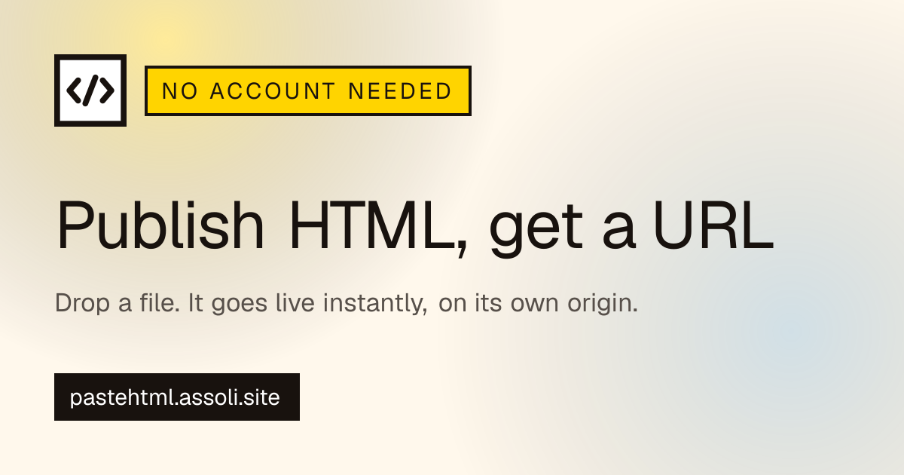
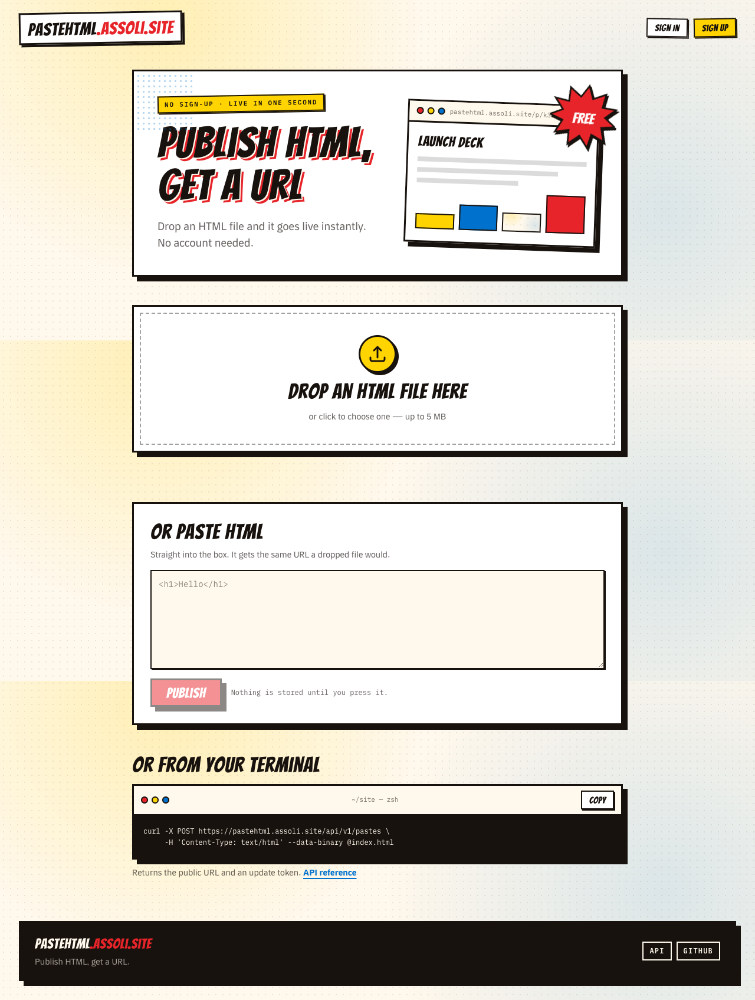
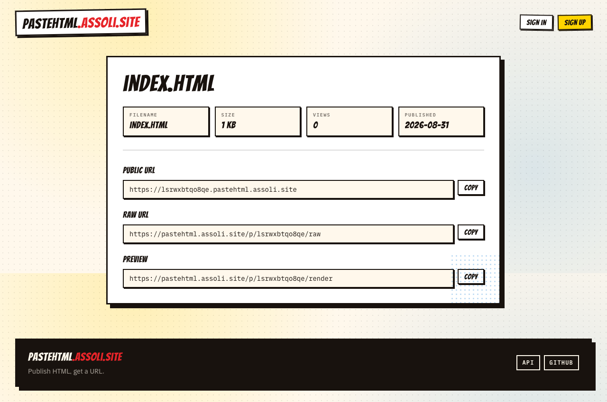

<p align="center">
  
</p>

<h1 align="center">pastehtml.assoli.site</h1>

<p align="center">
  Drop an HTML file, get a public URL on its own origin. No account, no build step.<br>
  <a href="https://pastehtml.assoli.site">pastehtml.assoli.site</a> · <a href="docs/api.md">REST API</a> · <a href="docs/mcp.md">MCP</a>
</p>

---

## What it does

- **Publish in one step** — drop a file, paste markup, `curl` it, or hand it to an
  agent over MCP. Every route ends at the same Convex function.
- **Its own origin per paste** — `<token>.pastehtml.assoli.site`, so uploaded HTML
  never shares an origin with the dashboard or a Clerk session.
- **Optional account** — publish anonymously, then claim the paste later with the
  update token it handed you.
- **Password-protected pastes** — PBKDF2 in Convex, unlock sessions scoped to the
  one subdomain, attempts throttled per client.
- **API keys and scopes** — `ph_…` bearer keys for the REST API and the MCP server,
  enforced inside Convex rather than at the edge.
- **Three managed services, no fourth** — Vercel, Convex, Clerk. No VM, no database
  to run.

<p align="center">
  
</p>

Publishing returns a page with every URL the paste answers on — the public origin,
the raw source, and a sandboxed preview:

<p align="center">
  
</p>

## Stack

Next.js (App Router) · TypeScript · Convex · Convex File Storage · Clerk ·
Tailwind CSS · shadcn/ui · MCP TypeScript SDK · Vitest · Playwright.

## Local development

```bash
npm install
npx convex dev          # links a Convex dev deployment, sets NEXT_PUBLIC_CONVEX_URL, runs codegen
npm run dev             # http://localhost:3000
```

Run `npx convex dev` in a separate terminal alongside `npm run dev` — it watches
`convex/` and keeps generated types in sync.

### Commands

| Command             | Purpose                         |
| ------------------- | ------------------------------- |
| `npm run dev`       | Next.js dev server              |
| `npx convex dev`    | Convex dev deployment + codegen |
| `npm run build`     | Production build                |
| `npm run lint`      | ESLint                          |
| `npm run typecheck` | `tsc --noEmit`                  |
| `npm run format`    | Prettier write                  |
| `npm run test`      | Vitest unit tests               |
| `npm run test:e2e`  | Playwright end-to-end tests     |

## Environment setup

Copy `.env.example` to `.env.local` and fill in:

- `NEXT_PUBLIC_APP_URL` — app origin (default `http://localhost:3000`).
- `NEXT_PUBLIC_CONVEX_URL` — set automatically by `npx convex dev`.
- `NEXT_PUBLIC_CLERK_PUBLISHABLE_KEY` / `CLERK_SECRET_KEY` — from the Clerk
  dashboard.

Required variables are validated at boot in `lib/env.ts`; a missing one throws
immediately.

## Authentication

Clerk holds the sessions; Convex verifies them. `convex/auth.config.ts` points at
`CLERK_JWT_ISSUER_DOMAIN` (set on the Convex deployment, not in `.env.local`), so
`ctx.auth.getUserIdentity()` inside a Convex function is checked against Clerk's
JWKS. **Every ownership decision happens there** — a Convex function derives the
caller from that identity and never from an argument, so no application-side
guard can be skipped to reach someone else's paste. `ownerId` stores Clerk's
`tokenIdentifier`, the stable identity key.

`lib/auth.ts` covers the Next.js side: `getCurrentUser` / `requireCurrentUser`
for server components and route handlers, and `authedConvex()` — a Convex client
that forwards Clerk's `convex` JWT so a server-side call runs as the signed-in
user rather than anonymously.

### Isolation from paste origins

A wildcard paste host never reaches Clerk. `proxy.ts` branches on the Host header
before `clerkMiddleware` runs, so there is no handshake and no session cookie on
`<token>.pastehtml.assoli.site`; the rewrite into the runtime also drops
`Authorization` and rebuilds `Cookie` from scratch, keeping only the paste's own
`ph_unlock` session, so a domain-scoped Clerk cookie added by mistake still would
not arrive. `e2e/auth.spec.ts` signs in for real and then asserts both halves:
the app cookie carries no leading-dot Domain, and `document.cookie` is empty
inside a paste.

There is no cookie-authenticated mutating endpoint in the app — Convex
authenticates with a bearer JWT, not cookies, and the app has no Server Actions —
so there is nothing for a cross-site request to forge. Milestone 15 revisits this
alongside the full header and CSP audit.

### Password-protected pastes

`pastes.setPassword` hashes with PBKDF2-HMAC-SHA256 through Web Crypto — the
strongest KDF the Convex V8 runtime has natively, so an unlock needs no Node
action. Only `pbkdf2-sha256$<iterations>$<salt>$<digest>` is stored, and the
record is self-describing so the cost can be raised without invalidating
existing passwords.

`resolveForRuntime` withholds the storage URL and the digest for a protected
paste, so the content is gated in Convex rather than at the serving layer. The
wildcard runtime answers with a challenge page; a correct password mints an
unlock session whose SHA-256 is stored in `pasteUnlocks` and whose secret goes
back as a host-only `HttpOnly` cookie. Both layers scope it: the browser sends
it only to that subdomain, and the session names its paste, so a copied cookie
unlocks nothing else. Changing or removing the password revokes every session.

Attempts are throttled per (paste, client address) — 10 in 15 minutes — so one
attacker cannot lock a shared paste out for everyone. `pastes.unlock` _returns_
its rejections rather than throwing, because a Convex mutation is a transaction
and throwing would roll back the attempt counter. Every rejection looks
identical, so the response never confirms that a subdomain exists.

The raw and preview endpoints live on the app origin, which the host-only unlock
cookie never reaches, so they stay closed for a protected paste.

### Claiming an anonymous paste

Publishing without an account returns an update token once. Sign in on the same
page and "Save to my account" calls `pastes.claim`, which verifies that token and
transfers ownership. The claim retires the token, so a paste can only ever be
taken into one account.

## Deployment

Production is `https://pastehtml.assoli.site`. Three managed services carry it,
and there is no fourth — no VM, no self-managed database, no Ruby, Rails or any
other runtime beside Node:

| Piece                                       | Runs on                                          | Shipped by                             |
| ------------------------------------------- | ------------------------------------------------ | -------------------------------------- |
| Next.js app, paste runtime, host routing    | Vercel — framework preset Next.js, Node 24, iad1 | `git push` to `main`                   |
| Schema, functions, file storage, rate limit | Convex                                           | `npx convex deploy`                    |
| Sessions and sign-in                        | Clerk                                            | dashboard configuration, no build step |

Which Convex deployment and which Clerk instance the site talks to is decided
entirely by the environment variables on the Vercel project — `CONVEX_DEPLOYMENT`,
`NEXT_PUBLIC_CONVEX_URL`, `NEXT_PUBLIC_CONVEX_SITE_URL` and the two Clerk keys.
Moving from a development instance to a production one is a change of values and
a redeploy, never a change of code. `NEXT_PUBLIC_*` is inlined at build time, so
every one of those changes needs the redeploy to take effect.

`docs/operations.md` has the runbooks; `docs/decommission.md` records why nothing
outside these three services is required.

## Domains

Every paste is served from its own origin, `<token>.pastehtml.assoli.site`, so
uploaded HTML never shares an origin with the dashboard.

### Vercel

The app is a subdomain of `assoli.site`, so there is no apex record to set. Add
both names to the Vercel project — `pastehtml.assoli.site` and the wildcard
`*.pastehtml.assoli.site`.

The wildcard is the constraint. Its certificate can only be issued over DNS-01,
so Vercel has to be able to write a record under the domain, which a plain
`CNAME` does not allow. Two ways to satisfy that:

**Move the zone to Vercel** (Vercel's own recommendation, and what it enables
automatically when you save a wildcard). In Namecheap: Domain List → `assoli.site`
→ Manage → Domain → NAMESERVERS → Custom DNS → the two names Vercel shows,
normally `ns1.vercel-dns.com` / `ns2.vercel-dns.com`. This moves DNS for _all_ of
`assoli.site`, so screenshot the Advanced DNS page first and recreate every record
(MX especially) under Vercel's DNS, or unrelated services on the domain break.

**Or keep Namecheap DNS** and delegate only the ACME name. In Namecheap's
Advanced DNS → Host Records, where the Host field takes the sub-part alone and
Namecheap appends the domain:

| Type  | Host                        | Value                              |
| ----- | --------------------------- | ---------------------------------- |
| CNAME | `pastehtml`                 | the per-project value Vercel shows |
| CNAME | `*.pastehtml`               | `cname.vercel-dns-0.com`           |
| NS    | `_acme-challenge.pastehtml` | `ns1.vercel-dns.com.`              |
| NS    | `_acme-challenge.pastehtml` | `ns2.vercel-dns.com.`              |

Do not hardcode the first CNAME's value: Vercel issues each project a unique one
(e.g. `d1d4fc829fe7bc7c.vercel-dns-017.com`), and the old shared
`cname.vercel-dns.com` is no longer correct everywhere. Copy what the dashboard
shows.

Either way, confirm both domains read **Valid Configuration** under Project →
Domains before cutover. `*.pastehtml.assoli.site` covers exactly one label, so
`a.b.pastehtml.assoli.site` is not certified and `lib/host.ts` refuses to route it.

Setting `NEXT_PUBLIC_APP_URL=https://pastehtml.assoli.site` needs a redeploy to
take effect — `NEXT_PUBLIC_*` is inlined at build time, and `lib/host.ts` derives
the root host from it.

### Locally

Browsers and macOS resolve every `*.localhost` name to the loopback address, so
no hosts-file entry or DNS is needed:

```bash
npm run dev
open http://localhost:3000                 # the app
open http://<token>.localhost:3000         # the paste that token published
```

`lib/host.ts` derives the root host from `NEXT_PUBLIC_APP_URL` and ignores the
port, so the same routing code runs in development and production.

## REST API

HTML can be published in one request, with or without an account:

```bash
curl -X POST http://localhost:3000/api/v1/pastes \
     -H 'Content-Type: text/html' --data-binary @index.html
```

`GET`, `PATCH` and `DELETE` on `/api/v1/pastes/{token}` read, update and remove
it. Three credentials are accepted — an `Authorization: Bearer ph_…` API key, a
Clerk session token, or the `X-Update-Token` an anonymous paste was published
with — and every one of them is verified inside Convex, never at the edge.

See `docs/api.md` for the full reference: request shapes, error codes and rate
limits.

## MCP

`POST /mcp` exposes the same operations to AI agents over the Model Context
Protocol — `create_paste`, `get_paste`, `update_paste`, `delete_paste`,
`list_pastes` — authenticated with the same `ph_…` API keys, whose scopes Convex
enforces. Anonymous publishing works there too.

```bash
claude mcp add --transport http pastehtml http://localhost:3000/mcp
```

See `docs/mcp.md` for the tool reference and authenticated setup.

## Testing

`npm run test` runs the Vitest suites (Convex functions under `convex-test`,
host routing, and the serving endpoints) and needs nothing running.

`npm run test:e2e` drives a real browser and needs both `npx convex dev` and a
Clerk development instance. The auth specs sign in as a `+clerk_test` fixture
user, which never receives real mail — create it once per instance:

```bash
clerk users create -d '{"email_address":["e2e+clerk_test@example.com"],"password":"<15+ chars>"}' --yes
```

`e2e/global.setup.ts` fetches Clerk's testing token (which bypasses bot
protection) from the keys in `.env.local`. Override the fixture address with
`E2E_CLERK_USER_EMAIL` if your instance uses a different one.

## Architecture

- `app/(marketing)` — public pages (home / publishing).
- `app/(dashboard)` — authenticated management UI.
- `app/api` — REST API (versioned under `v1`).
- `app/mcp` — MCP server for agents, over the same domain functions.
- `convex/` — backend: schema, queries, mutations, file storage.
- `lib/` — `env`, `config`, `errors`, `logger`, `request-id` shared modules.
- `proxy.ts` — host routing (wildcard paste origins) + Clerk on app hosts.
- `app/internal/paste/[subdomain]` — the paste runtime; reachable only through
  the rewrite in `proxy.ts`, never directly.

### App shell, PWA and SEO

`app/layout.tsx` holds the site-wide `metadata` — title template, description,
canonical, Open Graph and Twitter card — with `metadataBase` taken from
`NEXT_PUBLIC_APP_URL`, so a preview deployment advertises itself rather than
production. The card image is drawn at `app/opengraph-image.tsx` through
`next/og` — the comic panel, the burst and the site's own fonts, read from
`public/fonts/*.ttf` (Satori has no woff2) — so the pitch on it lives in one
place instead of in a committed PNG. `app/twitter-image.tsx` re-exports it: X's
card is the same 1200x630 crop.

`app/manifest.ts`, `app/icon.svg`, `app/apple-icon.png` and `public/icon-*.png`
make the app installable; `public/sw.js` is a hand-written service worker (~40
lines, no build step) that precaches `/offline` and answers a failed page
navigation with it. It touches nothing else: the API, MCP, sign-in and every
paste-content path are excluded, and a paste origin is a different origin
entirely, so no published page is ever in its reach.

Status pages share `components/status-page.tsx`: `app/not-found.tsx` (404),
`app/error.tsx` and `app/global-error.tsx` (500), and `app/422` — the page that
states what an upload has to satisfy, with the limits imported from the
validators that enforce them.

See `docs/conventions.md` for naming and error-code conventions, `docs/api.md`
for the REST API reference, `docs/mcp.md` for the MCP server,
`docs/operations.md` for monitoring and incident runbooks, `docs/migration.md`
for the legacy import tooling, `docs/decommission.md` for what the rebuild
replaced, and `docs/tasks.md` for the milestone plan.
